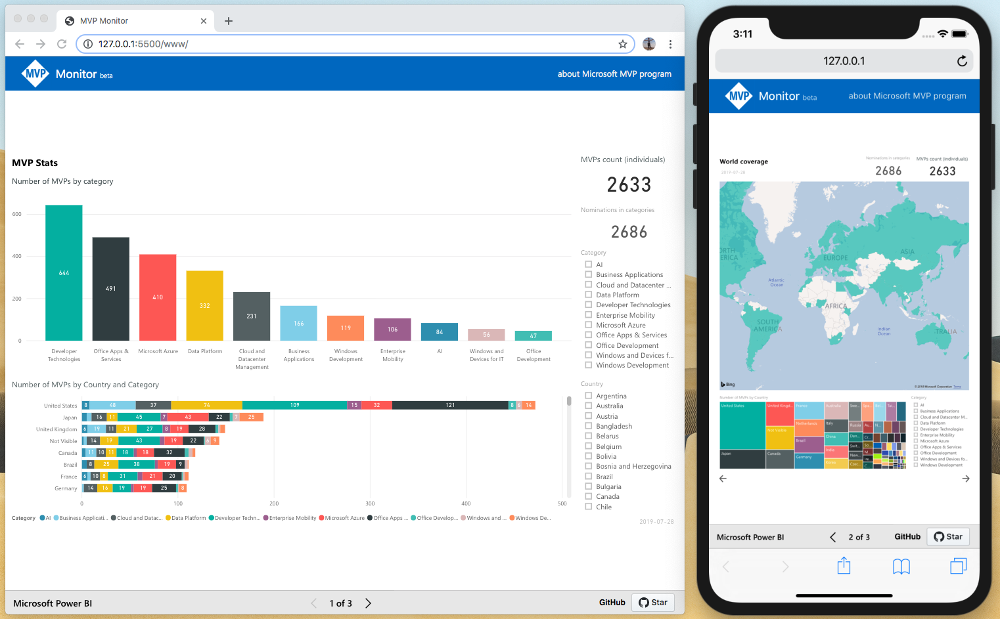

# Microsoft MVPs Monitor

> Have you ever wondered how many MVPs in specific categories and countries right now? Interested in historical trends of MVPs?

The project collects information about active Microsoft Most Valuable Professionals from [official MVP web site](https://mvp.microsoft.com).

Anonymous MVP statistics, such as nominations in contribution areas, is saved for historical purposes and exposed via publically published Power BI report.

Have an idea of a metric to add? Please create an issue request.

## How it works

1\. Node.js job scraps MVP site on schedule basis

2\. Structured data is dumped to SharePoint list as JSON document

3\. JSON is processed and used with Power BI

4\. Reports are published to web and used on a static site hosted in GitHub pages